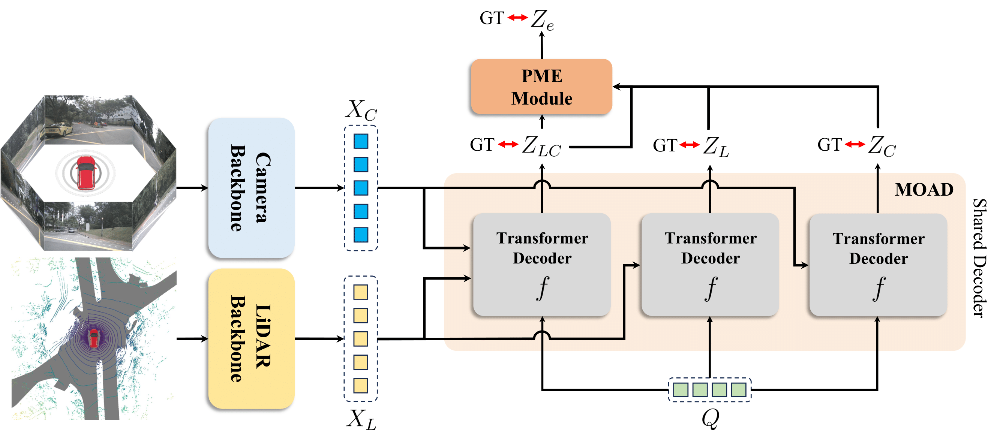

# Robust Multimodal 3D Object Detection via Modality-Agnostic Decoding and Proximity-based Modality Ensemble
[](https://arxiv.org/abs/2407.19156)
<div align="center">
    
    
    
</div><br/>
Juhan Cha*, Minseok Joo*, Jihwan Park, Sanghyeok Lee, Injae Kim, Hyunwoo J. Kim†.

## Installation

Please follow the instructions to set up the MEFormer

#### Environments
- Python 3.8
- CUDA 11.1
- PyTorch 1.10

#### 1. Clone Repository
```shell
git clone https://github.com/hanchaa/MEFormer.git
cd MEFormer
```

#### 2. Create environment & Install libraries
```shell
conda create -n MEFormer python=3.8
conda activate MEFormer
pip install torch==1.10.1+cu111 torchvision==0.11.2+cu111 torchaudio==0.10.1 -f https://download.pytorch.org/whl/cu111/torch_stable.html

pip install openmim
mim install mmcv-full==1.6.0
pip install -r requirements.txt
```

#### 3. Download pre-trained weights
Download the pretrained weight of the image backbone from [Google Drive](https://drive.google.com/drive/folders/1vNGjBxl__eF5ti-AAsNWFqJG4uBmYsPG?usp=drive_link) and move them to ckpts directory.
```shell
MEFormer
├─ ckpts
│  ├─ fcos3d_vovnet_imgbackbone-remapped.pth
│  └─ nuim_r50.pth
├─ figures
├─ projects
└─ tools
```

#### 4. Prepare data
Follow the instructions from [mmdet3d](https://github.com/open-mmlab/mmdetection3d/blob/1.0/docs/en/data_preparation.md) for data preparation.

## Train & Inference
#### Train
```shell
tools/dist_train.sh $path_to_config$ 8
```
#### Inference
```shell
tools/dist_test.sh $path_to_config$ $path_to_weight$ 8 --eval bbox
```

## Results
Results on nuScenes **validation set**.

| Config                                                                   |  NDS  |  mAP  | Schedule  | FPS |                                              weights                                               |
|:-------------------------------------------------------------------------|:-----:|:-----:|:---------:|:---:|:--------------------------------------------------------------------------------------------------:|
| [MEFormer](./projects/configs/meformer_voxel0075_vov_1600x640_cbgs.py)   | 73.9% | 71.5% | 6 epoch * | 3.1 | [Google Drive](https://drive.google.com/file/d/1dmyDZGhrhO_3vNx23j4_Umi-1qTnOJBj/view?usp=sharing) |
| [MEFormer w/o PME](./projects/configs/moad_voxel0075_vov_1600x640_cbgs.py) | 73.7% | 71.3% | 20 epoch  | 3.4 | [Google Drive](https://drive.google.com/file/d/1tfAqvGTC3mQ8lrsaXe1P5z5Hm0QtrCiL/view?usp=sharing) |

FPS is measured with a single NVIDIA A6000 GPU.

\* means MEFormer with PME should be trained after MEFormer w/o PME is trained first.
